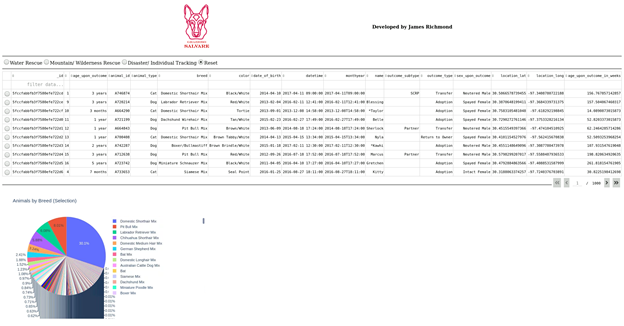
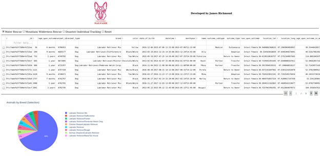
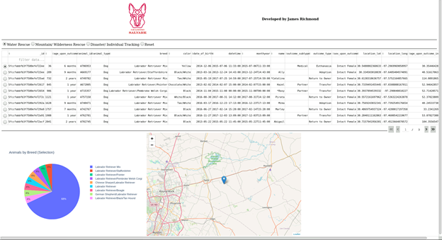

# GraziosoSalvare
A full stack Python web app to query a MongoDB database.

# About the Project
The Grazioso Salvare web-app is an interactive tool designed to assist in easily locating ideal candidate animals for search-and-rescue training.  The dashboard displays a data table showing animals from the AAC database using pre-defined search criteria.  The accompanying interactive map shows the exact location of selected animals.

# Tools Used
MongoDB was selected as the model component for this project.  The pre-existing AAC database existed in MongoDB, an ideal format for this application due to the large amount of semi-structured data.  MongoDB offers quickly and easily interfaceable access to this data.
The view and controller components of this application utilize Dash.  Dash enables quick development of custom interfaces and displays in web applications using Python, for which MongoDB also has a native driver.  This makes them an ideal pair for a full-stack application such as this one.

# Development
This tool requires installation of or access to an installation of MongoDB as well as a local installation of Python.  It has been tested using Python 3.9 and MongoDB 4.2.
The application uses a custom database access Python class to instantiate and query the database.  A Python script utilizing Dash components was written for the front-end application.  This script contains the query logic that provides the one-click access to custom searches using radio buttons.  Queried data is in turn displayed in a table that pages results by 10.  The front-end script also utilizes Dash components to provide the map feature and a pie chart showing the percentage of animals of each breed for a selected query.

# Usage
The application initially displays a table, with unfiltered data from the database.  Below the table is a pie chart showing breed, by percentage, of all animals within the selected filter.

Selecting one of the radio buttons along the top will filter the table to animals ideally suited to each purpose, as provided for in the specification.  The pie chart is updated to reflect the breakdown of breeds in this selection.

Each row in the table represents an animal in the database.  Selecting a row will show the animal’s location on the interactive map.  Clicking the marker on the map will display the animals name and breed.

# Challenges
One challenge area of development was developing the pie chart to display drill-down information on animal breed for selected.  Developing this function ended up much simpler than I originally thought, and extraneous code was breaking this feature for most of development.

# Questions
**Q**: *How do you write programs that are maintainable, readable, and adaptable? Especially consider your work on the CRUD Python module from Project One, which you used to connect the dashboard widgets to the database in Project Two. What were the advantages of working in this way? How else could you use this CRUD Python module in the future?*

**A**: Modularity goes a long way toward writing maintainable, readable, and adaptable programs.  This is why we developed a Python class to query the database.  This class provides access to the database given in this project, but could be easily adapted to suit any database

**Q**: *How do you approach a problem as a computer scientist? Consider how you approached the database or dashboard requirements that Grazioso Salvare requested. How did your approach to this project differ from previous assignments in other courses? What techniques or strategies would you use in the future to create databases to meet other client requests?*

**A**: I approach a problem as a Computer Scientist much the same way I approach any problem; what’s my desired outcome? What’s the purpose of what I’m doing? This is the top-level goal that broken down into smaller sub-problems.  For example, part of the assignment was to produce widgets that responded to queried data.  Before designing these widgets, it was important to know that we were getting the correct data in our queries.

**Q**: *What do computer scientists do, and why does it matter? How would your work on this type of project help a company, like Grazioso Salvare, to do their work better?*

**A**: At the most basic level, computer scientists use technology to solve problems, and why this matters really depends on whose problem you’re solving.  In the case of Grazioso Salvare, they needed an efficient way of finding the animals they were looking for with an application that was intuitive and didn’t require any user training.  There might have been other ways to achieve similar results, but those may have required users to have certain skills or be trained on those skills.

# Contact
James Richmond
james.richmond@snhu.edu
